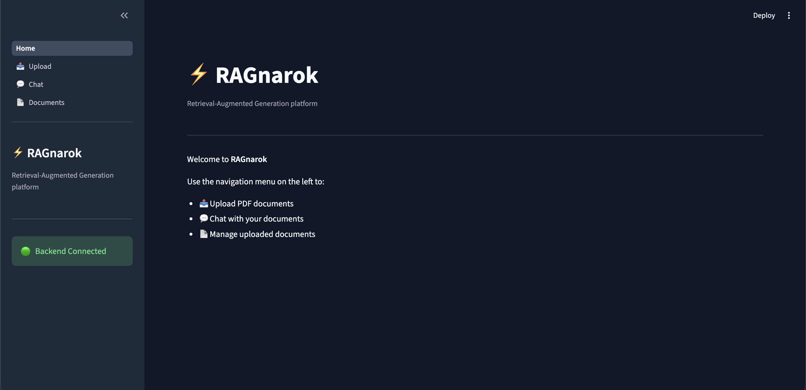
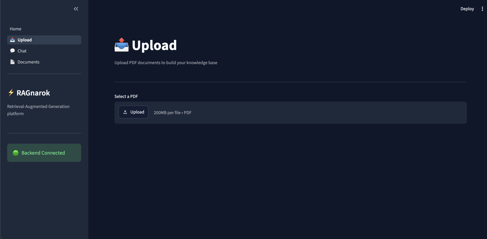
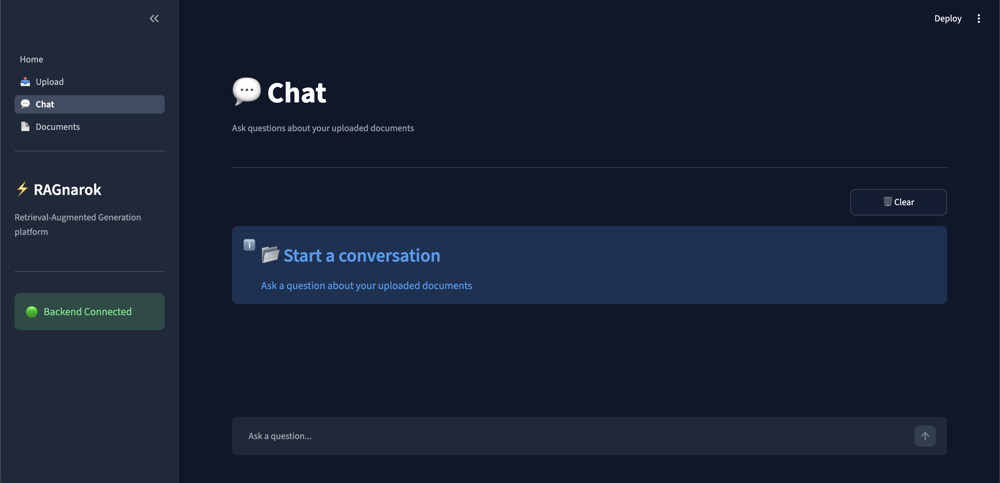
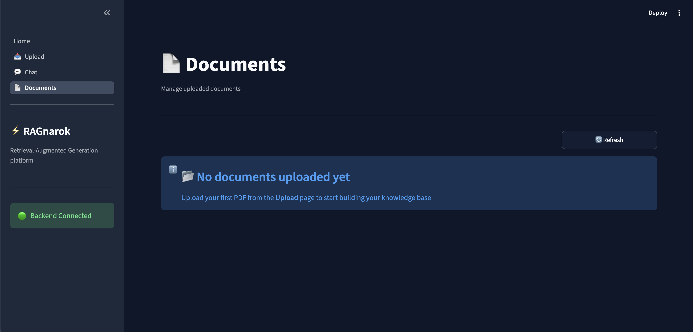
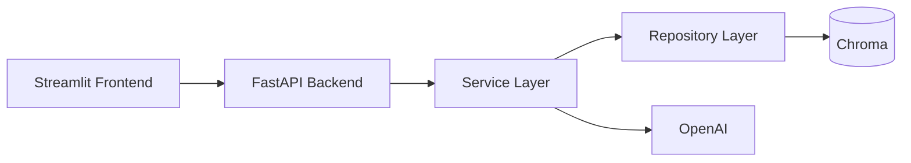
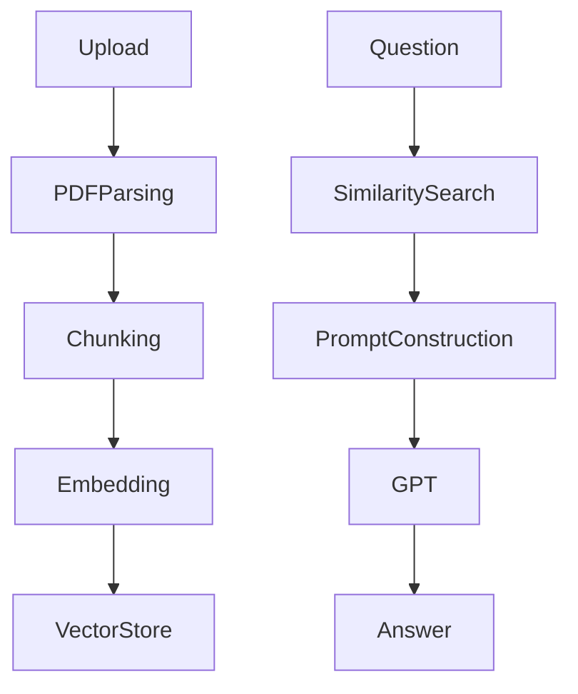
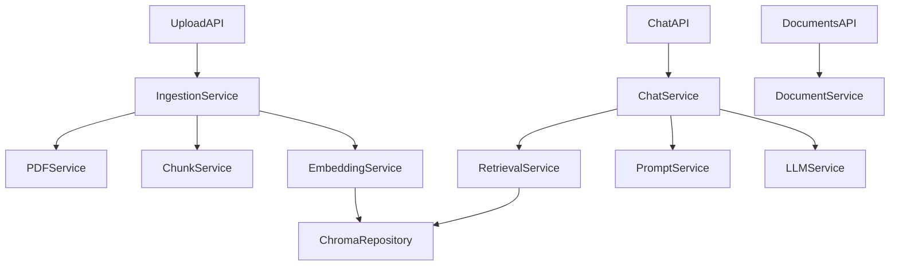
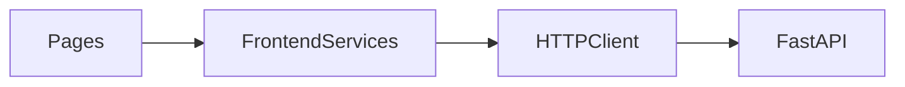

# ⚡️ RAGnarok
A **Retrieval-Augmented Generation (RAG)** application built with **FastAPI**, **LangChain**, **Chroma**, **OpenAI**, and **Streamlit**. Users can upload PDF documents, index them into a vector database, and ask natural language questions grounded on the uploaded documents.

## Screenshot
<figure>
  
  
<figcaption>RAGnarok Home Page</figcaption>

</figure>

<figure>
  
  
<figcaption>RAGnarok Upload Page</figcaption>

</figure>

<figure>
  
  
<figcaption>RAGnarok Chat Page</figcaption>

</figure>

<figure>
  
  
<figcaption>RAGnarok Document Page</figcaption>

</figure>

## Features
- PDF document ingestion
- Automatic text extraction
- Configurable text chunking
- OpenAI embeddings
- Persistent Chroma vector database
- Semantic retrieval
- GPT-powered question answering
- Document management
- Streamlit frontend
- REST API
- Unit and API tests
- GitHub Actions CI

## Architecture

## RAG Flow

## Backend Design

## Frontend Design

