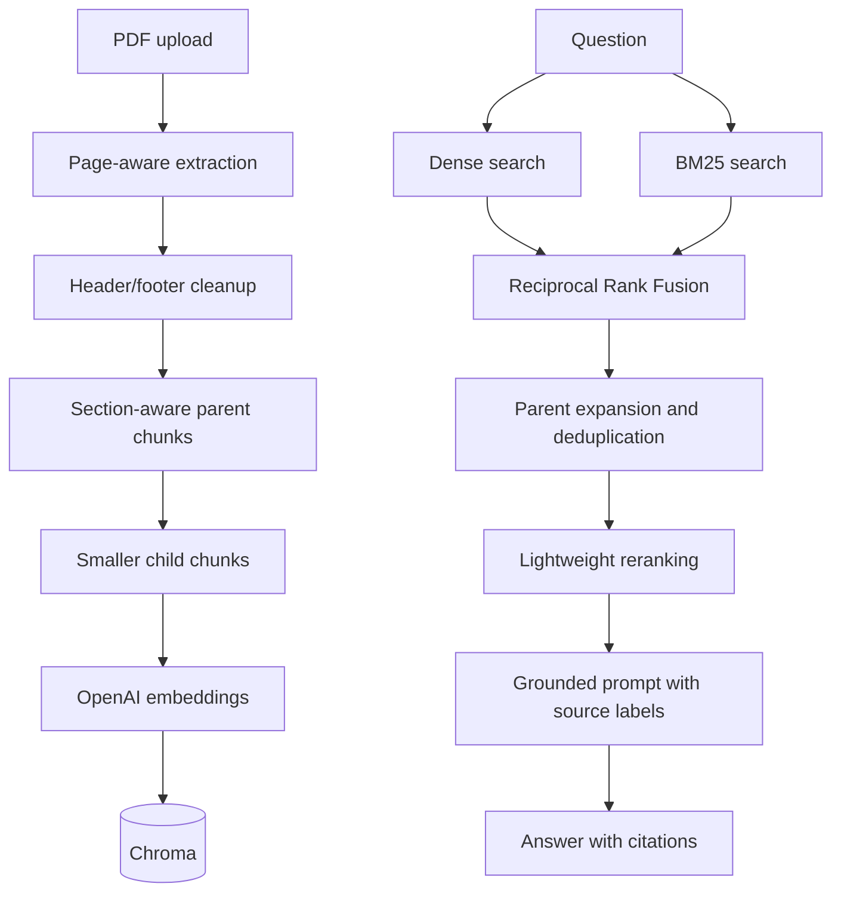
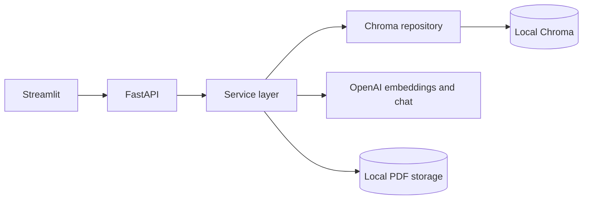

# ⚡ RAGnarok

RAGnarok is a local PDF question-answering application built with FastAPI,
Streamlit, LangChain, Chroma, and OpenAI. It combines page-aware parent-child
chunking with hybrid semantic and BM25 retrieval so answers remain precise while
retaining enough surrounding context.

This is intentionally a focused weekend project: local storage, one knowledge base,
and no authentication or deployment platform.

## Features

- PDF validation, extraction, and local file storage
- Repeated header and footer cleanup
- Page- and section-aware parent-child chunking
- Persistent OpenAI embeddings in Chroma
- Dense semantic search plus local BM25 keyword search
- Reciprocal Rank Fusion, parent expansion, and deterministic reranking
- Search across all PDFs or a selected subset
- Conversational follow-up query rewriting
- Grounded refusal when retrieval finds insufficient evidence
- Inline filename/page citations and matched source excerpts
- Upload, chat, and document-management pages
- FastAPI REST API with tested service and repository layers

## How retrieval works



Small child chunks improve search precision. The corresponding larger parent
sections are supplied to the chat model so it can answer with adequate context.
BM25 runs in process over the Chroma corpus, which keeps the architecture simple and
is appropriate for a small local document collection.

## Architecture



## Requirements

- Python 3.14
- [uv](https://docs.astral.sh/uv/)
- An OpenAI API key

## Setup

Clone the repository, then create the environment files:

```bash
cp backend/.env.example backend/.env
cp frontend/.env.example frontend/.env
```

Set `OPENAI_API_KEY` in `backend/.env`, then install both environments:

```bash
cd backend
uv sync --dev

cd ../frontend
uv sync

cd ..
```

Start both applications from the repository root:

```bash
uv run python run.py
```

The launcher creates the local data directories and starts:

- Streamlit: `http://localhost:8501`
- FastAPI: `http://localhost:8000`
- OpenAPI documentation: `http://localhost:8000/docs`

Stop both processes with `Ctrl+C`.

## Configuration

Backend settings are read from `backend/.env`.

| Variable | Default | Purpose |
| --- | --- | --- |
| `OPENAI_API_KEY` | Required | OpenAI authentication |
| `CHAT_MODEL` | `gpt-4.1-mini` | Answer and query-rewrite model |
| `EMBEDDING_MODEL` | `text-embedding-3-small` | Child-chunk embedding model |
| `CHROMA_PERSIST_DIRECTORY` | `data/chroma` | Persistent vector storage |
| `UPLOAD_DIRECTORY` | `data/uploads` | Uploaded PDF storage |
| `CHUNK_SIZE` | `500` | Child chunk size in characters |
| `CHUNK_OVERLAP` | `100` | Child and parent overlap in characters |
| `PARENT_CHUNK_SIZE` | `2000` | Parent context size in characters |
| `HYBRID_CANDIDATE_K` | `20` | Candidates from each retrieval method |
| `RRF_K` | `60` | Reciprocal Rank Fusion constant |
| `RETRIEVAL_SCORE_THRESHOLD` | `0.15` | Minimum deterministic reranking score |
| `RETRIEVAL_K` | `5` | Maximum parent contexts sent to the model |

The frontend reads `FRONTEND_API_URL`, which defaults to
`http://localhost:8000`.

Changing chunking settings affects newly indexed PDFs only. Delete and upload an
existing PDF again to re-index it.

## API

| Method | Path | Purpose |
| --- | --- | --- |
| `GET` | `/health` | Backend health check |
| `POST` | `/upload` | Validate, store, and index a PDF |
| `POST` | `/chat` | Ask a grounded question with optional history and document filters |
| `GET` | `/documents` | List indexed documents |
| `DELETE` | `/documents/{document_id}` | Delete a PDF and its vectors |

## Development checks

Run these commands from `backend/`:

```bash
uv run ruff check ../run.py ../frontend app tests
uv run ruff format --check ../run.py ../frontend app tests
uv run mypy app
uv run pytest --cov-fail-under=90
```

The test suite uses mocked OpenAI-facing services and does not require a real API
request. CI runs the same lint, formatting, type, test, and coverage checks.

## Project layout

```text
.
├── backend/
│   ├── app/api/           FastAPI routes
│   ├── app/repositories/  Chroma persistence and BM25 search
│   ├── app/services/      Ingestion, retrieval, prompting, and chat
│   ├── app/prompts/       Grounding and rewrite prompts
│   └── tests/             API, service, and repository tests
├── frontend/
│   ├── components/        Shared Streamlit UI
│   ├── pages/             Upload, chat, and document pages
│   └── services/          Backend HTTP client wrappers
├── images/                     Project screenshots
└── run.py                      Local two-process launcher
```

## Current scope

RAGnarok supports text-based PDFs and a single local knowledge base. OCR, user
accounts, background ingestion, cloud deployment, and large-corpus search services
are deliberately out of scope.

## Screenshots

| Home | Upload |
| --- | --- |
|  |  |

| Chat | Documents |
| --- | --- |
|  |  |
